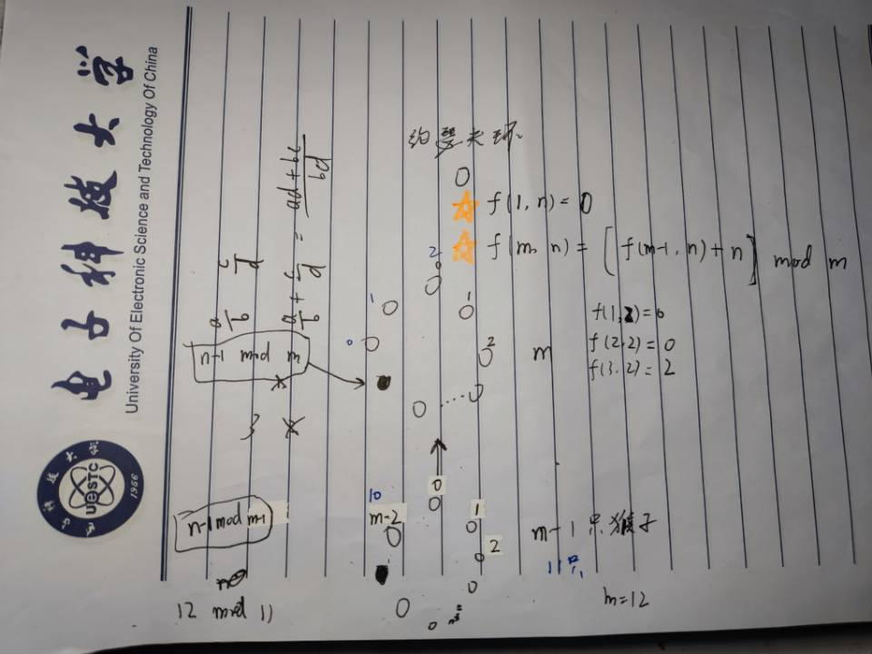

### 约瑟夫环问题推理手稿

约瑟夫环问题
设m只猴子的编号为0 ~ m-1, 设f(m, n)表示m只猴子每次报数到n最后剩下的猴子编号
经过推理，可以得到递推式：f(m, n) = [f(m-1, n) + n] mod m， 初值f(1, n) = 0
最终答案为f(m, n) + 1，时间复杂度O(T*m)

## $$f(1,n) = 0$$

## $$f(m,n) = [f(m-1,n)+n] \bmod m$$

