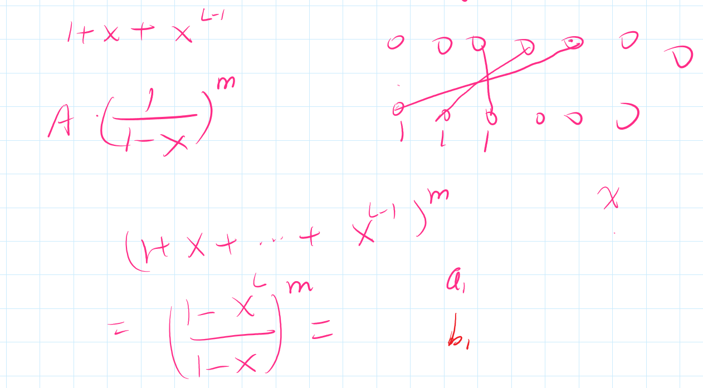

## 2.2

https://codeforces.com/group/SiKhFBFwPd/contest/423801

### [Short Question](https://codeforces.com/group/SiKhFBFwPd/contest/423801/problem/M)

切比雪夫距离转曼哈顿距离

### P3964 [TJOI2013]松鼠聚会

切比雪夫距离转曼哈顿距离

### [Factory Balls](https://codeforces.com/group/SiKhFBFwPd/contest/423801/problem/A)

BFS 竟然可过，时间复杂度为 $\mathcal O(2^{N+M} (K + M)) \approx \mathcal O(20,971,520)$ 

### [D - Triple Sword Strike](https://codeforces.com/group/SiKhFBFwPd/contest/423801/problem/D)

将 sumy 按照从大到小排序，设第 x 列有 |Sx| 个 坐标，对于每个x，在 sumy 暴力修改 |Sx| 个值，再在 sumy 中前 |Sx| + 2 大的值中找出 top2，再暴力恢复 sumy 数组原来的值。由于 |Sx| 的总和是 O(n) 的，所以时间复杂度正确。

## 2.3

毒瘤场

https://codeforces.com/group/SiKhFBFwPd/contest/423802

### [Sticks](https://codeforces.com/group/SiKhFBFwPd/contest/423802/problem/K)

想了好久，一开始暴力+贪心，后来贪心不对，又开始想网络流，但由于不是二分图，无法做最大独立集，最后半小时想到还可以状压DP，过了，最后题解告诉我暴力DFS枚举所有可能就行了

https://codeforces.com/contest/1791

CF Div 4.

本以为 AK 了，结果 G2 假了，Div4. AK 成就又达成失败了

### [Teleporters (Hard Version)](https://codeforces.com/contest/1791/problem/G2)

正确做法应该是枚举第一个位置，然后二分排序后的前缀和数组

## 2.4

https://atcoder.jp/contests/abc288

史上打得最烂的 ABC，参赛体验只有 10min

### **D - Range Add Query**

这题卡了整场比赛，期间看了下 E 感觉 DP 也不简单，遂一直做 D，要是看下 F 的话还是能做出来 F 的

结论就是区间下标同余K的元素求和，得到的相等就是YES，不相等就是NO

### [E-Wish List](https://atcoder.jp/contests/abc288/tasks/abc288_e)

感觉这 DP 不太容易想到，状态设 $f[i][j]$ 表示前 $i$ 个物品里面买 $j$ 个的最小花费（当然前 $i$ 个物品里在清单里的必须要买）。对于第 $i$ 个物品，如果买它之前它前面的物品有 $j$ 个已经被买走了，那么附加花费就是 $\min \{C_{i-j}, C_{i-j+1}, \dots , C_i \}$。转移就简单了，不写了

### [F-Integer Division](https://atcoder.jp/contests/abc288/tasks/abc288_f)

F 是自己想出来的，对我来说感觉比 D、E 简单，$DP$ 很显然，方程很好推：
$$
\large f_i = \sum_{j \ge 0} f_j \cdot \text{Num}(j+1,i)
$$
然后就是优化，容易发现 $\text{NUM}(j+1, i) $ 和  $\text{NUM}(j+1, i+1) $ 是有联系的，所以不妨继续推下 $f_{i+1}$，懒得打公式了，最后结果就是
$$
\large f_{i+1} = 10 f_i + \text{sum}(i, a_{i+1})
$$

## 2.5

https://codeforces.com/contest/1786

Div1 + Div2 都是 tourist 出题

### [Letter Exchange](https://codeforces.com/contest/1786/problem/D)

我是纯人脑分类大讨论，眼睛都看花了，花了 2h。后来看了 [jiangly 的代码](https://codeforces.com/contest/1785/submission/192288659)，发现思路是一样的，不过如果 STL 用得好的话能够减少很多冗余代码

## 2.6

https://codeforces.com/gym/103627

毒瘤场纯纯浪费时间

### [Yet Another Interval Graph Problem](https://codeforces.com/gym/103627/problem/E)

E过了，下午的做法是假的。题解的做法是考虑如何让剩下的连通块size <= K 且权值和最大，将区间端点离散化，f[i]表示仅考虑区间右端点 <= i的所有区间，选取若干区间使得构成的连通块合法且权值和最大

枚举最后一个构成的连通块，f[i] = max { f[j] + g(j + 1, i) }, g(j + 1, i)表示仅考虑区间左右端点都在[j+1, i]的区间，构成1个连通块，权值最大为多少。g(j+1, i)只需要取 top-k 即可

## 2.8

https://codeforces.com/group/SiKhFBFwPd/contest/426108

CCPC 2018 绵阳

### [H - Hamming Distanc](https://codeforces.com/group/SiKhFBFwPd/contest/426108/problem/H)

有点意思的贪心题。相同的位置一定放 a。将不同的位置拿出来一起处理，从后往前，尝试放 1 ~ i 放 a 是否可行。

### [B - Array Modify](https://codeforces.com/group/SiKhFBFwPd/contest/426108/problem/B)

和洛谷 P5488 前缀和与差分 那道题类似。这题先反转数组，然后乘上生成函数即可。据说正解是 $\mathcal O(n\log n)$，但我不会。

### [A - Array Merge](https://codeforces.com/group/SiKhFBFwPd/contest/426108/problem/A)

vp的时候穷尽了各种思路和方法，还是没有想出来。

这题有意思，我做了严格的推理和证明，写在平板上了。

## 2.10

https://codeforces.com/group/SiKhFBFwPd/contest/423806

### [Periodic Ruler](https://codeforces.com/group/SiKhFBFwPd/contest/423806/problem/J)

这题逻辑有点绕。首先不能作为周期的数有两种情况：

1. a[i] != a[j]，则 abs(i - j) 的所有约数都不能作为周期

2. 该周期t不是最小循环节。即模t后不产生矛盾，所有生成元都存在，且存在t' < t, t'是周期，则t不是周期 

### [Or Machine](https://codeforces.com/group/SiKhFBFwPd/contest/423806/problem/H)

很有意思的Dij，多起点的Dij

建图不难想到，考虑一个结点最早什么时候能有1到达，这是一个多起点的最短路，距离需要特殊定义

这里的距离是用二元组(i, j)来定义的，i表示需要多少整数轮, j表示i轮后还需要多少次操作

### [Equivalent Pipelines](https://codeforces.com/group/SiKhFBFwPd/contest/423806/problem/C)

哈希。像这种大型抽象集合的比较，应该想到哈希

### [Automatic Sprayer 2](https://codeforces.com/group/SiKhFBFwPd/contest/423806/problem/A)

构造题，==坑待填==。

## 2.12

https://codeforces.com/group/SiKhFBFwPd/contest/425283

### [Divisible by 3](https://codeforces.com/group/SiKhFBFwPd/contest/425283/problem/E)

使用平方和公式，可以将 $\text{weight}(i, j)$ 化为两个前缀和相减的形式，再在 mod 3 下简单 DP 就可。==坑待填==

### [Reverse Game](https://codeforces.com/group/SiKhFBFwPd/contest/425283/problem/B)

由于这种题曾被 CF Div2 C 题卡过一次，还记得。

观察给的 4 种子串变换，就是等价于每次把 0 移到 1 的前面，每次轮最多可以操作 2 次

统计总共能移的次数为 $n$，操作转化为每次可以将 $n$ 减 1 或 减 2，最后无法再减（ $n=0$）就输。打个表可以很容易发现当 $ n \bmod 3 = 0$ 时先手会输

### [Mistake](https://codeforces.com/group/SiKhFBFwPd/contest/425283/problem/M)

拓扑序竟然没有用。对于输入的数字 $x$ ，$x$ 第几次出现就输出几。😄

### [Modulo Permutations](https://codeforces.com/group/SiKhFBFwPd/contest/425283/problem/I)

排列计数，基本遇到一次就放弃一次，这次经过不懈奋斗终于想出来了。

第一步。由于比较条件“循环”的，圆排列的感觉，故钦定 1 排在第 1 位，最后答案乘 $n$

第二步。观察发现，$n(n \ge 3)$ 只能放在 $1$ 或 $2$ 的后面

上面两步一般都能发现，接下来这一步就看能不能观察出来了

第三步。考虑一个合法的排列是如何生成的，就是从小到大插入数，每次把数插在 $1$ 或 $2$ 的后面，并且插入的数和插入位置右边的数满足题目条件。可以证明，该生成方法和与所有的合法排列之间是充要条件。由此，我们可以得到一个 $\mathcal O(n^2)$ 的 DP 做法

第四步。实现第三步的做法，验证正确性。然后观察如何优化，

每次计算出当前答案后，枚举 $i$ 的倍数，把对后面答案的贡献累加上。时间复杂度降至 $\mathcal O(n \log n)$

没想到正解做法就是这样，1s 1e6 nlogn 这样出题真行啊，虽然常数确实小。

## 2.28

https://codeforces.com/contest/1796

Edu 144 Div. 2

气麻了，室友吵得没法写题，白打一场，不然肯定不会掉分，ABCD 肯定能过

### 牛客15165 字符串的问题

答案要么是 nxt[n] 要么是 nxt[nxt[n]]

## 3.2

https://codeforces.com/contest/1800

第一场 CF Div3. ，体验不错，还以为能 AK 了，最后一题没出，最后 Rank 296 可还行，可惜不计rating

### [D-Remove Two Letters](https://codeforces.com/contest/1800/problem/D)

感觉题目很诈骗，我写的字符串双哈希过了，正解果真很简单

### [G-Symmetree](https://codeforces.com/contest/1800/problem/G)

一眼树哈希，我觉得 CF 应该不会考这种 useless 的算法，我还去看了下洛谷树哈希的板子，n 的范围很小，而这题 n 范围比较大，应该不是哈希

哈哈，没想到题解真是树哈希，属实不会科技没办法，会估计~~就有机会 AK 了~~

关于树哈希的两篇文章：

https://peehs-moorhsum.blog.uoj.ac/blog/7891

https://codeforces.com/blog/entry/113465

试了下洛谷树同构那题，我才发现洛谷那题是**无根树哈希**，这题是**有根树哈希**。也就是说**无根树哈希比较困难**，能处理的数据范围比较小，**有根树哈希还是比较容易**

