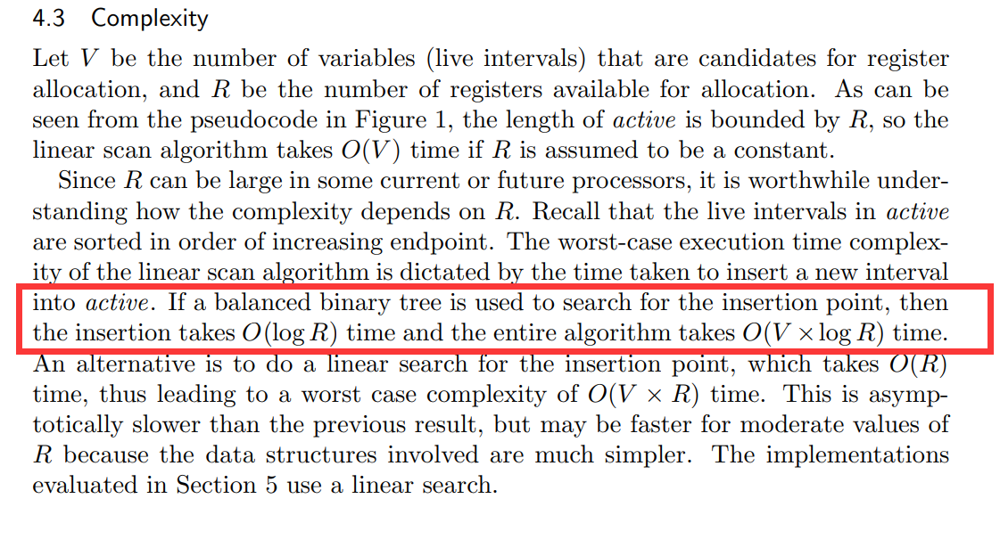
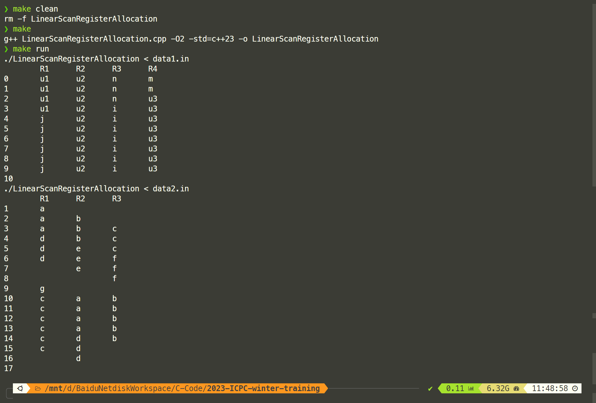

## Introduction

我根据自己的理解用C++实现的一个线性分配算法
利用`std::multiset` 作为平衡树，该算法的时间复杂度为 $\mathcal O (n\log R)$,  $n$ 为活跃区间数量，$R$ 为寄存器的数量
该算法相比原始算法有如下改进：

1. 任意时刻寄存器空出来了都会尝试重新分配，算法尽可能让寄存器得到最充分的利用
2. 同一个变量可以输入多个活跃区间，以获得更精细的分配策略（原始算法仅仅是找一个最小的活跃区间覆盖所有活跃信息）
3. 使用STL的容器，将时间复杂度由 $\mathcal O (nR)$ 降低为 $\mathcal O (n\log R)$（尽管大多数情况下寄存器比较少，在实际中可能提升不大）



## Build && Run

```shell
make clean
make
make run
```

